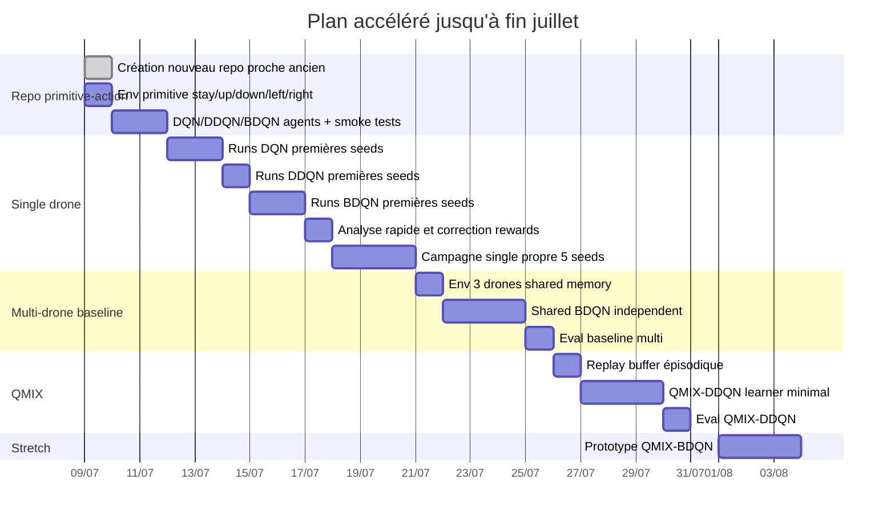

# Gantt — objectif mi/fin juillet

## Version réaliste

- Mi-juillet : single-drone DQN/DDQN/BDQN propre.
- Fin juillet : shared BDQN 3 UAV + premier QMIX-DDQN.
- QMIX-BDQN : bonus, pas chemin critique.
